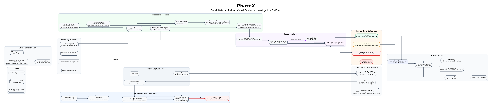

# Retail Return / Refund Visual Evidence Investigation Platform

Status: target production specification for `sco_vision`.

This document defines what the application must do when the refactor is complete. It is intentionally product, architecture, and reliability focused. Advanced MLOps/evaluation work is the only explicitly deferred category; all runtime functionality described here is core product scope.

Process-flow diagram asset:



## 1. Product Mission

The system is a local/offline Retail Return / Refund Visual Evidence Investigation Platform.

When a POS return or refund transaction arrives, possibly up to 30 minutes after the event, the system must find the matching return-counter CCTV video window and determine whether there is visual evidence that a physical item was presented at the return counter.

The system must not accuse anyone of fraud. It must preserve evidence, explain limitations, and route decisions through human review.

Valid machine outcomes are only:

- `VERIFIED`: visual evidence supports that a physical item was presented at the return counter.
- `REVIEW`: evidence is ambiguous, obstructed, low confidence, incomplete, or model output is unreliable.
- `HIGH_RISK_REVIEW`: POS indicates return/refund, but clear visual evidence does not verify a physical item. This is not fraud proof.
- `INVALID_VIDEO`: footage is missing, corrupt, too short, wrong, or clock alignment is not trustworthy.

Any adverse business action must be made by a human reviewer outside the model.

## 2. Operating Constraints

The target deployment is a local DGX-style machine with no runtime internet dependency.

Business and camera constraints:

- One camera covers the return counter.
- The return counter zone is visible.
- The return bin is not visible.
- Customer hands may be partially visible.
- Staff ID is available from POS.
- POS batches may arrive up to 30 minutes late.
- False accusations are unacceptable.

Runtime constraints:

- All production model weights must be repo-local under `./models/hf/...`.
- Required runtime assets currently expected locally are Qwen3-VL, Gemma BF16, Falcon Perception, and SAM2.
- Optional/non-blocking assets are SAM3, dedicated Falcon-OCR, InternVL, Grounding DINO, and Grounding DINO 1.5.
- Runtime code must not call `snapshot_download`, `hf_hub_download`, `pip install`, or any network fetch.
- Development mode may use `~/.cache/huggingface`; production/offline mode must not.
- The app must run from a USB-copied repo on another equivalent DGX after verification.
- The app must fail clearly when required local assets are missing.

## 3. User Story

1. A customer interacts with staff at the return counter.
2. CCTV is continuously recorded into immutable local video segments.
3. The POS system emits a return/refund event. It may arrive immediately or later in a batch.
4. The app idempotently ingests the POS event and creates or reuses a case.
5. The app uses the POS event timestamp, not the ingest timestamp, to resolve the matching CCTV window.
6. If the video window cannot be reconstructed, the case becomes `INVALID_VIDEO`.
7. If video is valid, perception models inspect the window and create timestamped evidence.
8. Qwen3-VL reviews the structured evidence and keyframes; Gemma is fallback only.
9. A deterministic decision policy emits one of the four safe outcomes.
10. A reviewer opens the case, watches the clip, sees keyframes/tracks/OCR/limitations, and records a human decision.
11. The evidence package, hashes, model run metadata, reviewer action, and audit trail are saved locally.

## 4. Architecture Overview

High-level flow:

```text
RTSP camera
  -> continuous segment recorder
  -> immutable segment store + segment index

POS return/refund event
  -> idempotent POS ingest
  -> case builder
  -> POS-to-video window resolver
  -> footage validation

valid window
  -> perception pipeline
     -> Falcon Perception detection
     -> SAM2 segmentation/mask propagation
     -> traditional tracker
     -> temporal object memory
     -> Falcon OCR on receipt/document/label crops
     -> keyframe selection
  -> evidence package + evidence graph
  -> Qwen3-VL verifier/reasoner
  -> Gemma fallback if needed
  -> deterministic decision policy
  -> reviewer workflow
  -> audit trail
```

The system has three truth layers:

1. POS records: transaction facts from the business system.
2. Visual evidence: timestamped video, detections, masks, tracks, OCR, and keyframes.
3. Human review: reviewer labels and final operational action.

VLM narrative is advisory. It is never the sole source of truth.

The diagram above is the visual contract for the local product architecture. It captures:

- offline local runtime verification and model bundle requirements
- one return-counter CCTV input and delayed POS input
- continuous segment recording, immutable segment storage, and segment indexing
- POS-led case creation and video-window reconstruction
- Falcon, SAM2, tracking, temporal memory, OCR, and keyframe perception flow
- Qwen3-VL primary reasoning with Gemma fallback
- deterministic decision policy with only the four review-safe outcomes
- immutable evidence package, reviewer dashboard, and append-only audit trail
- memory guard, retry/error handling, no runtime network dependency, and no automatic accusation

## 5. Repository Ownership

This remains the same repo: `sco_vision`.

Current MVP modules to keep and evolve:

- `rtsp_reader.py`: RTSP capture/reconnect primitive.
- `zone_trigger.py`: ROI/motion primitive.
- `video_encoder.py`: evidence MP4 encoding primitive.
- `falcon_detector.py`: Falcon Perception adapter, later moved behind `perception/`.
- `gemma_reasoner.py` and `transformers_server.py`: Gemma fallback path.
- `classifiers.py`: review-safe prompt catalog compatibility layer.
- `monitor.py`: temporary live runtime, to be split into recorder/workers.
- `static/index.html`: temporary dashboard, to become case review workflow.

Target module ownership:

```text
app/
  main.py
  api/
    health.py
    pos.py
    cases.py
    evidence.py
    review.py
    memory.py
  config.py

db/
  models.py
  session.py
  migrations/
  repositories/

pos/
  ingest.py
  schemas.py
  correlation.py

video/
  rtsp_reader.py
  segment_recorder.py
  segment_index.py
  window_builder.py
  integrity.py
  encoder.py

perception/
  falcon_client.py
  sam2_client.py
  sampling.py
  tracker.py
  temporal_memory.py
  ocr.py
  keyframes.py
  pipeline.py
  schemas.py

reasoning/
  providers/
    base.py
    chain.py
    qwen3_vl.py
    gemma.py
  decision_policy.py
  prompts/

evidence/
  artifacts.py
  graph.py
  package.py
  timeline.py

review/
  workflow.py
  labels.py

scripts/
  prepare_offline_model_bundle.py
  verify_offline_bundle.py
  verify_offline_python_env.py
  memory_status.py
```

## 6. Offline Runtime Specification

Production mode is enabled by `FRAUD_OFFLINE_MODE=1`.

Required production model assets:

- `Qwen/Qwen3-VL-30B-A3B-Instruct`: primary VLM verifier/reasoner.
- `google/gemma-4-26B-A4B-it`: fallback reasoner.
- `tiiuae/Falcon-Perception`: detection and OCR-capable perception checkpoint.
- `facebook/sam2-hiera-large`: required deployable segmenter until SAM3 is actually available.

Optional assets:

- SAM3: preferred future segmenter upgrade when a real public checkpoint is available.
- Falcon-OCR specialized checkpoint: OCR quality optimization, not required if Falcon Perception covers OCR.
- InternVL and Grounding DINO variants: benchmark-only.

Production startup must run or require:

```text
python scripts/verify_offline_bundle.py --production
python scripts/verify_offline_python_env.py
```

The app must not start production inference if required assets are missing.

For USB/offline portability, `models/hf/` and the Python runtime dependency source must be copied or rebuilt explicitly. Git commits alone do not carry ignored model weights or wheelhouse contents.

## 7. Memory Policy

The app must be designed for a 128GB DGX-style machine without consuming all memory by default.

Configuration:

```yaml
reasoning:
  primary_provider: qwen3_vl
  fallback_provider: gemma
  warm_fallback: false

gpu:
  max_loaded_big_vlms: 1
  soft_memory_limit_gb: 90
  hard_memory_limit_gb: 100
  emergency_memory_limit_gb: 110
  poll_interval_sec: 5
  on_hard_limit: unload_models
  on_emergency_limit: stop_inference_workers
```

Required behavior:

- Qwen3-VL is lazy-loaded: do not load weights at app startup.
- Gemma is a cold fallback: do not load it unless Qwen fails or is disabled.
- Qwen and Gemma must not be loaded simultaneously by default.
- Falcon/SAM/OCR workers must be lazy-loaded or isolated so their memory footprint is controlled.
- If Qwen OOMs, unload Qwen, clear CUDA cache, then try Gemma fallback.
- New inference jobs must be refused or deferred when memory is above the soft limit.
- At the hard limit, refuse new model loads, unload non-active models, and clear CUDA cache.
- At the emergency limit, stop inference workers gracefully while keeping recorder/API/reviewer paths alive if possible.

Memory status must be visible through an endpoint or script:

- total memory
- used memory
- active loaded providers
- pending unloads
- degraded mode reason
- whether inference is accepting new jobs

Segment recording and evidence persistence must continue even when inference is degraded.

## 8. POS Ingest and Correlation

POS ingest must be idempotent.

Natural key:

```text
store_id + terminal_id + transaction_id + line_id
```

Supported event types:

- `RETURN`
- `REFUND`
- implementation-specific equivalents normalized into return/refund

The system stores:

- raw POS payload
- normalized POS event
- staff ID
- item/SKU/description if available
- POS event timestamp
- ingest timestamp
- batch ID if applicable

Correlation algorithm:

1. Ingest POS event.
2. Reuse existing event/case if natural key already exists.
3. Use `pos_event_at` as the center of the CCTV search, not `ingested_at`.
4. Compute default window, for example `pos_event_at - 120s` to `pos_event_at + 180s`.
5. Apply clock drift margin.
6. Query segment index for overlapping CCTV chunks.
7. Validate coverage and file integrity.
8. If coverage is insufficient, mark `INVALID_VIDEO`.
9. If valid, create a video window and enqueue analysis.

Delayed POS batches are normal. The segment store exists specifically so late POS events can still be investigated.

## 9. CCTV Segment Store

The recorder continuously writes immutable CCTV segments.

Segment requirements:

- fixed duration chunks, for example 60 seconds
- never overwrite existing segments
- local path configurable under the repo/storage root
- content hash recorded
- frame count and time range recorded
- corruption/gap detection recorded

Segment metadata:

```json
{
  "camera_id": "cam_01",
  "start_at": "2026-06-15T14:00:00Z",
  "end_at": "2026-06-15T14:01:00Z",
  "path": "...",
  "sha256": "...",
  "fps": 25,
  "width": 1920,
  "height": 1080,
  "frame_count": 1500,
  "corrupt": false,
  "has_gap": false
}
```

Failure handling:

- Missing segments: `INVALID_VIDEO`.
- Corrupt segments: `INVALID_VIDEO`.
- Partial coverage: `INVALID_VIDEO` or `REVIEW` only if enough evidence exists and missing interval is irrelevant; default must be conservative.
- Clock mismatch: `INVALID_VIDEO` or `REVIEW`, never `HIGH_RISK_REVIEW`.

## 9A. Storage Retention and Disk Safety

Storage retention and disk safety are core reliability requirements, not advanced MLOps.

Configuration:

```yaml
storage:
  raw_segment_retention_hours: 10
  min_free_disk_gb: 100
```

`min_free_disk_gb` may be adjusted for a smaller target disk, but production must have a configured free-space floor. The default should protect the recorder, database, evidence packages, and model bundle from disk exhaustion.

Retention policy:

- Raw continuous CCTV segments that are not linked to a case or evidence package are retained for 10 hours, then become eligible for cleanup.
- Segments linked to any case, video window, evidence package, review action, or audit trail must never be auto-deleted.
- Evidence packages, case clips, keyframes, masks, OCR crops/results, review actions, and audit logs are retained unless explicitly archived or deleted by an admin action.
- Cleanup must never remove artifacts needed to reproduce a reviewer-visible decision.
- Cleanup must be append/audit friendly: deletion actions must be logged with segment/artifact IDs, path, reason, and actor/process.

Required cleanup tooling:

```text
python scripts/cleanup_storage.py --dry-run
python scripts/cleanup_storage.py --execute
```

Requirements:

- `--dry-run` is the default and deletes nothing.
- `--execute` is required for deletion.
- Cleanup only deletes expired, unlinked raw segments.
- Cleanup reports candidate count, bytes reclaimable, oldest candidate, and preserved linked evidence count.
- Cleanup must verify database linkage before deleting any segment file.
- Cleanup must tolerate missing files and already-deleted unlinked segments without crashing.

Required disk status:

- total disk
- used disk
- free disk
- storage root size
- oldest raw segment
- number of expired deletable raw segments
- number of protected linked segments/artifacts
- low-disk/degraded reason if active

Disk status must be available through an endpoint or script. A low-disk guard must pause or stop raw segment recording when free disk falls below `storage.min_free_disk_gb`. It must keep the API and reviewer UI alive if possible and must not delete linked evidence automatically.

Required tests:

- expired unlinked raw segment is deleted only with `--execute`
- `--dry-run` deletes nothing
- linked segment is preserved even if expired
- evidence package artifacts are preserved
- low-disk state blocks recorder but keeps API/reviewer paths available

## 10. Perception Pipeline

The perception layer produces timestamped evidence. It is not a narrative layer.

Pipeline:

1. Decode the resolved video window.
2. Sample frames:
   - low FPS across the whole window
   - higher FPS around motion/counter bursts
   - highest FPS around handover candidates
3. Run Falcon Perception on sampled frames for open-vocabulary detections.
4. Run SAM2 on candidate physical items to create masks and improve track association.
5. Run traditional tracking over detections/masks.
6. Maintain temporal object memory.
7. Run Falcon OCR on cropped receipt/document/label regions.
8. Select evidence keyframes.
9. Emit timeline events and evidence graph nodes.

Falcon detection queries include:

- bag
- shopping bag
- item
- product
- box
- package
- clothing
- receipt
- document
- paper
- hand

Tracker requirements:

- Traditional tracker owns object IDs.
- VLM must not create or merge track IDs.
- Track lifecycle includes tentative, confirmed, lost, and closed states.
- Track events must include timestamps and frame IDs.

Temporal memory fields:

```json
{
  "track_id": "track_001",
  "label": "shopping bag",
  "first_seen_ts": "...",
  "last_seen_ts": "...",
  "zones": ["customer_zone", "counter_zone"],
  "events": ["appeared", "moved_to_counter", "handover_candidate"],
  "occlusion_intervals": [],
  "physical_item_candidate": true,
  "receipt_candidate": false,
  "confidence": 0.76
}
```

OCR policy:

- Run OCR only on receipt/document/paper/label/product-box crops.
- Do not OCR full frames continuously.
- OCR is supporting evidence, not proof.
- Low-quality or unreadable OCR must not create a high-risk decision.

## 11. Reasoning Pipeline

Qwen3-VL is the primary verifier/reasoner.

Gemma is fallback only.

The VLM receives:

- POS event summary
- video window metadata
- selected keyframes with frame IDs and timestamps
- track summaries
- OCR results
- limitations
- perception timeline

The VLM must output review-safe JSON. It may explain what is visible, but it must not decide fraud, accuse intent, or invent tracks.

Required output fields:

```json
{
  "handover_occurred": true,
  "physical_item_presented": true,
  "receipt_visible": false,
  "items_observed": ["bag"],
  "narrative": "A customer-side object is visible moving to the counter.",
  "confidence": "medium",
  "obstructed": false,
  "camera_view_clear": true,
  "limitations": [],
  "citations": [
    {"frame_id": "frame_042", "timestamp": "...", "track_id": "track_001"}
  ]
}
```

The deterministic policy wraps the VLM output and remains final authority.

Decision rules:

- Missing/corrupt footage -> `INVALID_VIDEO`.
- Clear physical item track reaches counter/staff -> `VERIFIED`.
- Receipt/document visible but no physical item in clear unobstructed window -> `HIGH_RISK_REVIEW`.
- Obstruction, low confidence, model failure, model disagreement, clock uncertainty -> `REVIEW`.
- Invalid VLM JSON -> `REVIEW`.

The VLM cannot upgrade a case to `VERIFIED` without track/perception evidence.

## 12. Evidence Package

Every analyzed case must produce a local immutable evidence package.

Package contents:

- POS payload and normalized POS record
- video window metadata
- segment references and hashes
- evidence clip/proxy clip
- keyframes
- detection summaries
- masks/tracks
- OCR crops and OCR text
- VLM model run metadata
- decision policy output
- limitations
- reviewer actions
- package hash

Example:

```json
{
  "case_id": "...",
  "pos_event": {},
  "video_window": {},
  "artifacts": [],
  "perception": {
    "tracks": [],
    "keyframes": [],
    "ocr": []
  },
  "reasoning": {
    "provider_chain": ["qwen3_vl", "gemma"],
    "used_provider": "qwen3_vl",
    "model_snapshot": "...",
    "prompt_version": "return_review_v1"
  },
  "decision": {
    "outcome": "REVIEW",
    "risk_score": 0.5,
    "reasons": []
  },
  "audit": {
    "created_at": "...",
    "package_sha256": "..."
  }
}
```

Evidence packages must be append/versioned, not overwritten silently.

## 13. Basic Evidence Graph

The evidence graph may be implemented in relational tables plus JSON first.

Required node types:

- POS_EVENT
- CASE
- VIDEO_WINDOW
- VIDEO_SEGMENT
- KEYFRAME
- DETECTION
- MASK
- TRACK
- OCR_RESULT
- VLM_CLAIM
- DECISION
- REVIEW_ACTION
- ARTIFACT
- LIMITATION

Required edge types:

- LINKED_TO_TRANSACTION
- HAS_WINDOW
- COVERS_SEGMENT
- OBSERVED_IN
- TRACKS_OBJECT
- SUPPORTS_CLAIM
- CONTRADICTS_CLAIM
- LIMITED_BY
- REVIEWED_AS
- PACKAGED_AS

Every claim must be traceable to frames, timestamps, tracks, OCR, or explicit limitations.

## 14. Reviewer Workflow

The reviewer UI/API is core functionality, not MLOps.

Reviewer queue shows:

- case ID
- POS transaction ID
- staff ID
- item/SKU/description
- POS event time
- outcome
- reason summary
- evidence readiness

Case detail shows:

- POS details
- synchronized video playback
- keyframes
- timeline events
- object tracks/masks
- OCR text
- Qwen/Gemma model explanation
- limitations
- evidence package hash
- audit trail

Reviewer actions:

- verified physical return
- needs review
- high-risk review
- invalid video
- camera blind spot
- POS/camera mismatch
- reprocess requested

The UI must not use user-facing labels like fraud, fraudulent, theft, suspect, or accusation.

## 15. API Surface

Required APIs:

```text
GET  /api/v1/health
GET  /api/v1/memory

POST /api/v1/pos/returns/event
POST /api/v1/pos/returns/batch

GET  /api/v1/cases
GET  /api/v1/cases/{case_id}
POST /api/v1/cases/{case_id}/reprocess

GET  /api/v1/cases/{case_id}/evidence-package
GET  /api/v1/cases/{case_id}/evidence-graph
POST /api/v1/cases/{case_id}/review-actions

GET  /api/v1/video/windows/{window_id}/stream
GET  /api/v1/video/segments/coverage
```

The legacy dashboard endpoints may remain during migration, but final product behavior must be transaction-led.

## 16. Audit Trail

Audit trail is required now.

Must record:

- POS ingest
- case creation
- video window resolution
- invalid-video determination
- perception run
- VLM run
- decision policy output
- evidence package creation
- reviewer action
- reprocess action
- model/config/prompt changes if exposed

Audit records must include:

- actor type and ID
- timestamp
- entity type and ID
- action
- before/after JSON where applicable
- reason
- request/source metadata when available

## 17. Reliability Requirements

Core reliability is not deferred.

Required:

- idempotent POS ingest
- retry count for analysis jobs
- error/dead states
- raw CCTV retention and disk cleanup
- low-disk recorder pause/stop behavior
- missing footage handling
- corrupt footage handling
- model outage handling
- GPU OOM handling
- memory soft/hard/emergency behavior
- clock drift handling
- storage path checks
- no runtime network dependency
- clear startup failure if required offline assets are missing

Failure rules:

| Failure | Required behavior |
|---|---|
| duplicate POS event | reuse existing event/case |
| missing CCTV window | `INVALID_VIDEO` |
| corrupt segment | `INVALID_VIDEO` |
| partial/ambiguous view | `REVIEW` |
| Qwen unavailable | unload/clear if needed, try Gemma |
| Qwen and Gemma both fail | `REVIEW` |
| VLM invalid output | `REVIEW` |
| GPU soft limit | defer/refuse new inference |
| GPU hard limit | unload models/clear cache |
| GPU emergency limit | stop inference workers, keep recorder/API if possible |
| disk below free-space floor | pause/stop recorder, keep API/reviewer alive |
| expired unlinked raw segment | cleanup eligible after 10 hours |
| linked evidence segment/artifact | never auto-delete |

## 18. Security Baseline

Advanced enterprise security can mature later, but basic safety is core:

- Do not expose RTSP credentials in the UI.
- Redact secrets from logs.
- Do not expose model endpoints publicly.
- Keep model servers bound to localhost or private network.
- Audit review actions.
- Make prompt/config changes traceable if editable.
- Do not serve evidence files without route-level control in production mode.

Full SSO/OIDC, tenant isolation, and long-term compliance reporting can be phased after the local functional product works.

## 19. Deferred: Advanced MLOps / Evaluation

Only the following are explicitly deferred:

- large labeled dataset program
- benchmark dashboard
- experiment tracking UI
- model registry UI
- prompt registry UI
- long-running calibration studies
- A/B model governance workflow
- formal reviewer-overturn analytics

Not deferred:

- storing model name/snapshot in evidence packages
- storing prompt version/hash
- storing decision policy version
- basic smoke tests
- basic benchmark script hooks if cheap
- raw segment retention and disk safety
- prompt/config visibility and traceability when editable
- evidence package/graph persistence for actual runtime evidence

Evidence reproducibility fields must exist now even if advanced MLOps dashboards come later.

## 20. Acceptance Criteria

The app is functionally production-ready for local/offline testing only when all of these pass:

1. `scripts/verify_offline_bundle.py --production` exits 0.
2. `scripts/verify_offline_python_env.py` exits 0.
3. Tests pass.
4. Qwen3-VL is primary in the live runtime chain.
5. Gemma is fallback, not warm-loaded by default.
6. Qwen and Gemma are not loaded simultaneously by default.
7. POS event creates or reuses a case.
8. Delayed POS resolves the correct CCTV window.
9. Missing/corrupt footage produces `INVALID_VIDEO`.
10. Valid footage produces an evidence package.
11. Perception emits detections, tracks, keyframes, OCR structures where applicable.
12. VLM output is wrapped by deterministic policy.
13. Outcomes are only `VERIFIED`, `REVIEW`, `HIGH_RISK_REVIEW`, `INVALID_VIDEO`.
14. Reviewer can open a case and record an action.
15. Audit trail records the action.
16. User-facing UI contains no accusation/fraud language.
17. Memory guard blocks/degrades inference under configured limits.
18. Runtime works without internet.
19. Raw unlinked CCTV segments older than 10 hours are cleanup-eligible.
20. Linked case/evidence/audit artifacts are never auto-deleted.
21. Low disk space pauses/stops recording before disk exhaustion without taking down the API/reviewer UI.

Until all of the above are true, the app may be testable as a partial checkpoint, but it is not complete.
